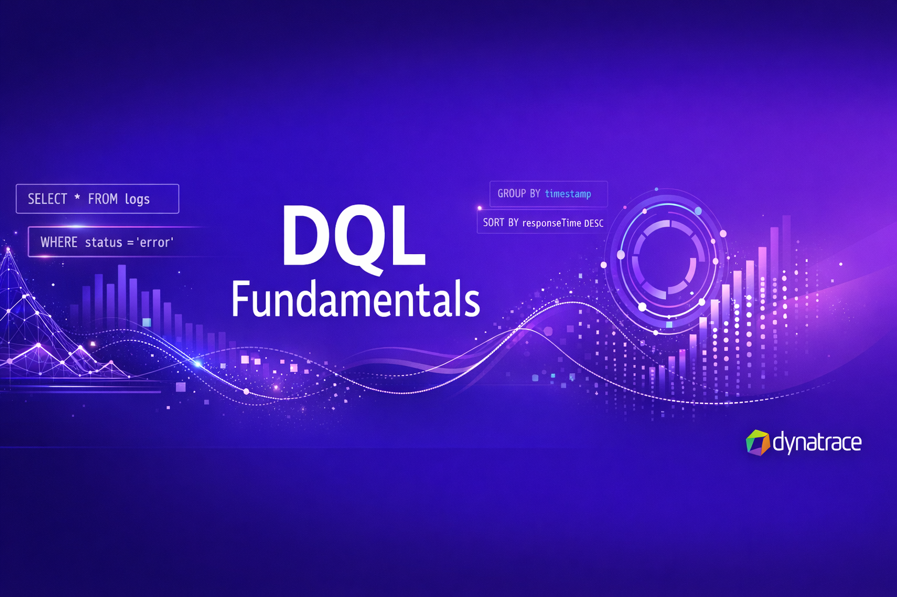

--8<-- "snippets/index.js"

--8<-- "snippets/disclaimer.md"

--8<-- "snippets/dt-enablement.md"

# DQL Fundamentals

{ align=right ; width="350";}

Welcome to the **Dynatrace Query Language (DQL) Fundamentals** workshop.

## Overview

This hands-on lab teaches you how to query, filter, summarize, and visualize data in Dynatrace using DQL through interactive Notebooks. Through 7 progressive exercise modules and 3 real-world use cases, you'll master the universal language for querying all observability data in the Dynatrace platform.

## What you'll learn

- **Logs** — Fetch, filter, parse, and visualize log data (Parts 1-3)
- **Metrics** — Query timeseries, CPU usage, and use Davis forecasting
- **Events** — Analyze Davis problems, entity relationships, and vulnerabilities
- **Business Events** — Trading data analysis with summarization and JSON parsing
- **CoPilot** — Use Davis CoPilot for AI-assisted DQL queries

## Prerequisites

--8<-- "snippets/grail-requirements.md"

## How it works

1. Download the Exercise Notebooks from the [Exercises folder](https://github.com/dynatrace-wwse/enablement-dql-fundamentals/tree/main/Exercises)
2. Upload them to your Dynatrace environment as Notebooks
3. Follow the exercises — each has empty DQL query sections for you to complete
4. When done, upload the corresponding [Answer Notebook](https://github.com/dynatrace-wwse/enablement-dql-fundamentals/tree/main/Answers) to check your work

## Lab structure

| # | Topic | Skills |
|---|-------|--------|
| 1 | [Logs Part 1](logs-part-1.md) | `fetch`, `filter`, timeframes, `fieldsAdd`, `fieldsRemove` |
| 2 | [Logs Part 2](logs-part-2.md) | `summarize`, `sort`, `limit`, aggregation functions |
| 3 | [Logs Part 3](logs-part-3.md) | `parse`, data extraction, visualization |
| 4 | [Metrics](metrics.md) | `timeseries`, `filter`, Davis forecasting |
| 5 | [Events](events.md) | `fetch events`, entity traversal, `lookup`, vulnerability analysis |
| 6 | [Business Events](bizevents.md) | `fetch bizevents`, trading analysis, JSON parsing |
| 7 | [CoPilot](copilot.md) | AI-assisted DQL with Davis CoPilot |
| 8 | [Use Cases](use-cases.md) | Real-world scenarios with sample data |

---

- [Let's get started :octicons-arrow-right-24:](getting-started.md)

